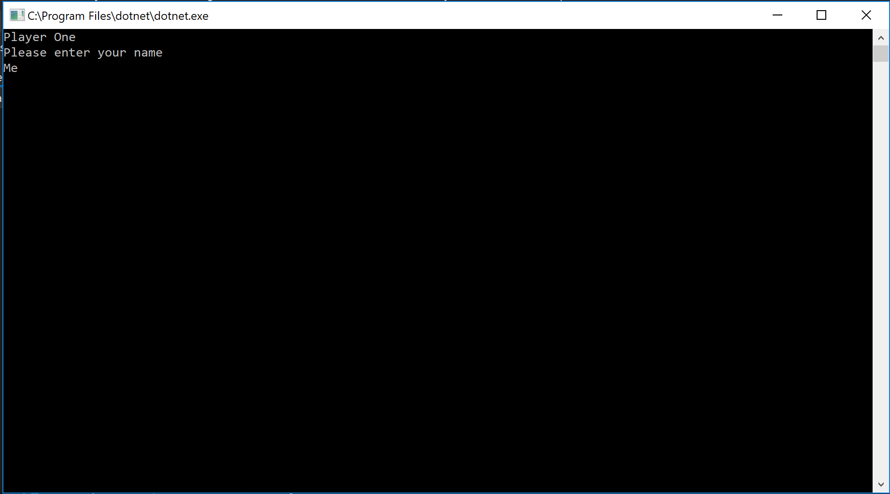
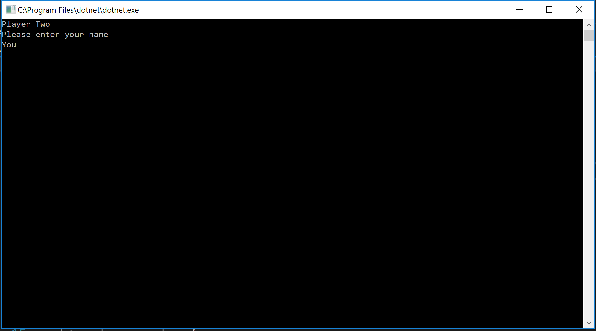
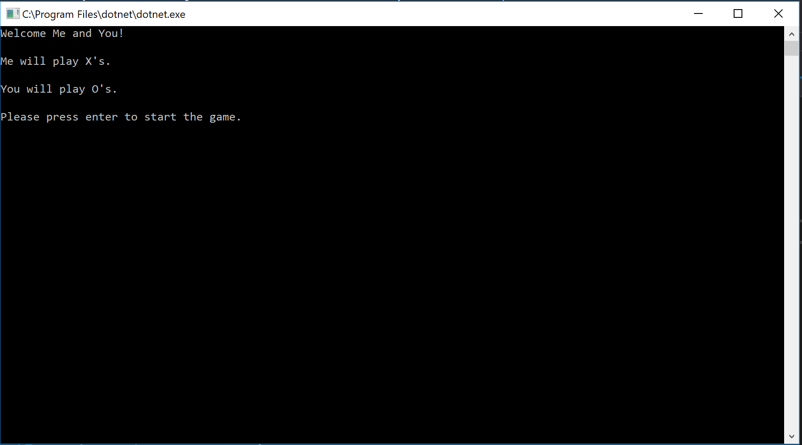
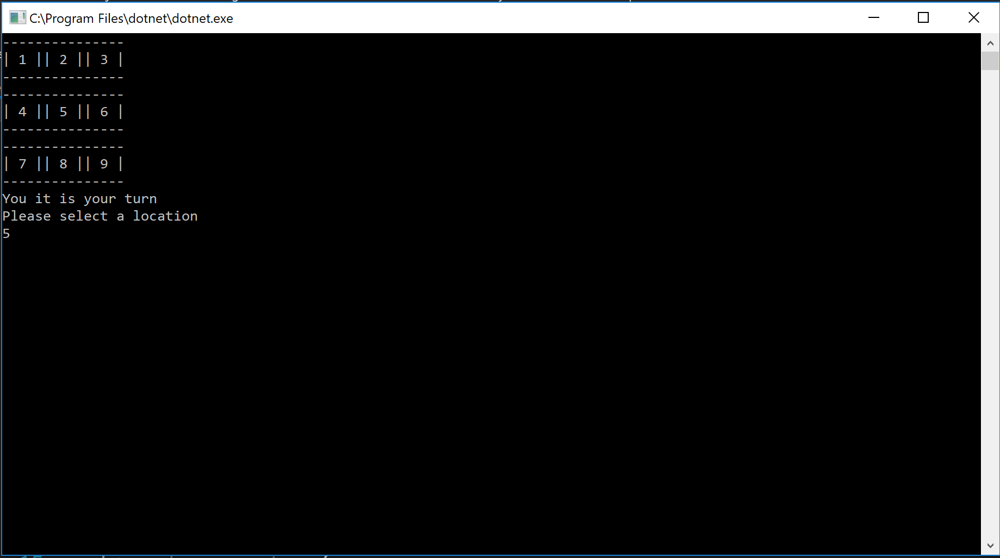
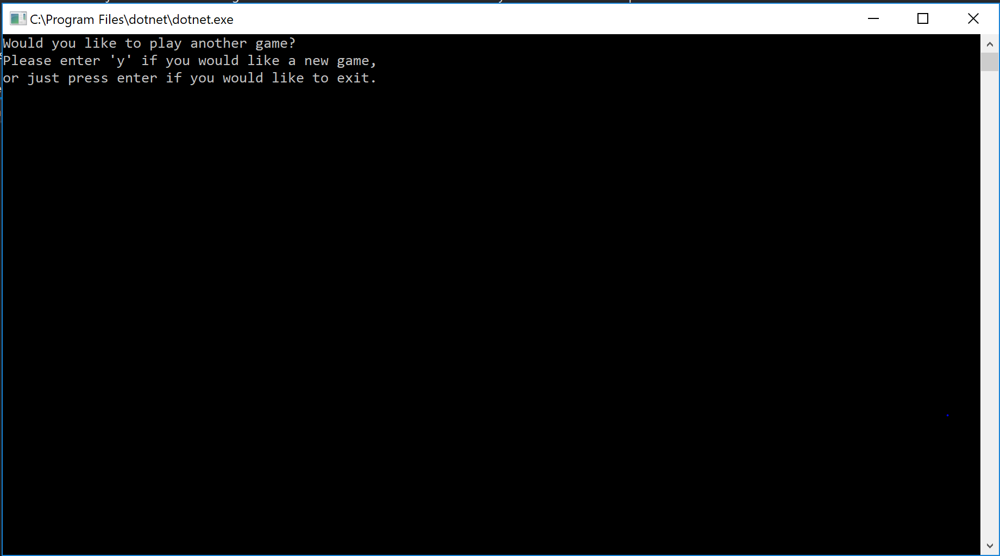

# Lab04-Tic Tac Toe

------------------------------

# Tic Tac Toe Game
#### Lab04-Tic Tac Toe
##### *Author: Mike Kelly*

------------------------------

## Description
This C# program is a console based Tic Tac Toe game

------------------------------

## Getting Started
Clone this repository to your local machine.
```
$ git clone https://github.com/Michael-S-Kelly/Lab04TicTacToe.git
```
#### To run the program from Visual Studio:
Select ```File``` -> ```Open``` -> ```Project/Solution```

Next navigate to the location you cloned the Repository.

Double click on the ```TicTacToe``` directory.

Then select and open ```TicTacToe.sln```

------------------------------

## Visuals


##### Application Start-Enter Player 1

##### Enter Player 2

##### Welcome Player 1 & Player 2

##### Player 2's Turn

##### Player 1's Turn

##### Restart or End Game


------------------------------

## Change Log


------------------------------
## Collaborators, Contributors, and Other Resources used

### Collaborators

### Contributors


### Other Resources
#### Microsoft Visual C# Step by Step Ninth Edition
#### C# 7.0 in a Nutshell
#### C# Pocket Reference
------------------------------
For more information on Markdown: https://www.markdownguide.org/cheat-sheet